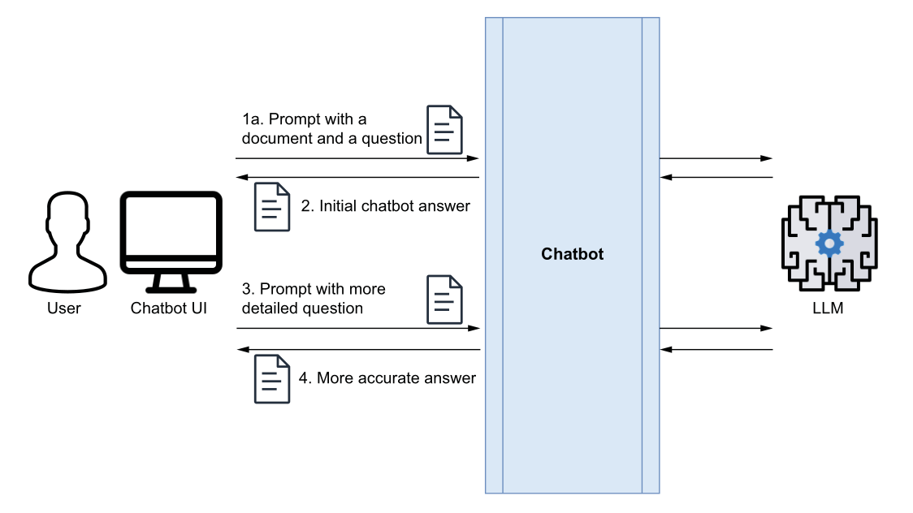

# مبانی RAG با استفاده از chromaDB

برای یک داکیومنت مکانیزم یک چت بات Q&A به صورت زیر می باشد: (در واقع موضوع ساده ای است)




برای knowledge base بزرگتر و چت بات پیچیده تر داریم:

.png)

### دیزاین پترن RAG

دو استیج اصلی برای دیزاین پترن رگ وجود دارد:

۱. استیج content ingestion یا indexing

.png)

۲. استیج جواب دادن سوال

.png)

## vector stores

وکتور استور ها برای محاسبه فاصله یا شباهت بردارها از تابع های معروفی مثل موارد زیر استفاده میکنند :

- فاصله اقلیدسی
- فاصله کسینوسی
- فاصله همینگ

اولین وکتور استوری که ابداع شد milvus بود که در سال 2019 خلق شد که البته برای image recognition ایجاد شده بود که در واقع بردار در آن سیستم نمایانگر معنای تصویر بود که حالا بعدا کاربرد های دیگر وکتور استور ها در سیستم های توصیه گر و سیستم های مبتنی بر مدل های زبانی نمایان شد.

اولین وکتور استور ها با عنوان vector libraries شناخته میشوند مانند FAISS که توسط متا توسعه داده شد که کارایی و سرعت خیلی خوبی داشت ولی با پیشرفت LLM ها محدودیت های vector library ها بیشتر مشخص شد مانند:

- افزایش پیچیدگی پیاده سازی:‌ چرا که باید در کنار امبدینگ ها شما اصل متن یا تصویر را در جایی دیگر ذخیره میکردید و نیاز داشتید که برای هر کدام یک unique identifier داشته باشید تا امبدینگ و متن اصلی با هم هماهنگ باشند و خب این موضوع پیچیدگی و نگه داری کد را سخت تر میکند.
- آنها (vector library) از داده ساختار های غیرقابل تغییر استفاده میکنند و این برای مواردی که داده ها مدام تغییر می کنند مشکل زا است
- در حین نوشتن داده ها نمیتوان به vector library کوئری زد و خب این موضوع روی عملکرد و مقیاس پذیری اثر منفی می گذارد.

به همین دلیل برخی شرکت ها مثل pinecone وکتور دیتابیس ها را توسعه دادند که:

- هم امبدینگ و هم متن اصلی (به همراه متادیتا ها) را ذخیره میکنند.
- پشتیبانی کامل از CRUD که برای موقعیت هایی که دیتا دائما تغییر میکند مناسب است
- پشتیبانی از سرچ و کوئری زدن در هنگام ingestion

و همچنین مزایای بیشتری نیز دارند مانند :

- caching
- sharding
- partitioning

البته باید بگم که دیتابیس های sql و nosql بعد ها پشتیبانی از وکتور ها را ایجاد کردند و شما میتوانند مثلا از PostgreSQL برای انجام برخی از پروژه های خود استفاده کنید.

در جدول زیر میتواند معروف ترین vector store ها را مشاهده کنید:

| Vector Store | Type | Website |
| --- | --- | --- |
| FAISS | vector library | https://github.com/facebookresearch/faiss/wiki/ |
| Milvus | Vector database | https://milvus.io |
| Qdrant | Vector database | https://qdrant.tech |
| Chroma | Vector database | www.trychroma.com |
| Weaviate | Vector database | https://weaviate.io |
| Pinecone | Vector database | www.pinecone.io |
| Vald | Vector database | https://vald.vdaas.org |
| ScaNN | Vector library | https://mng.bz/dWaw |
| PgVector | PostgresSQL extension | https://github.com/pgvector/pgvector |
| MongoDB Atlas | MongoDB extension | www.mongodb.com/ |

برای فهم بهتر اینجا سعی میکنیم که یک مثال با chromaDB داشته باشیم:

```bash
pip install chromadb
```

```python
import chromadb

chroma_client = chromadb.Client()

example_collection = chroma_client.create_collection(name="example_collection")
```

در گام بعد به دیتابیس content اضافه میکنیم:

```python
# Creating and populating a ChromaDB collection
tourism_collection.add(
	documents=[
		"Paestum, Greek Poseidonia, …[shortened] … Greek temples.",
		"Poseidonia was probably …[shortened] … in the 18th century.",
		"The ancient Greek part of …[shortened] … from the site."
	],
	metadatas=[
		{"source": "https://www.britannica.com/place/Paestum"},
		{"source": "https://www.britannica.com/place/Paestum"},
		{"source": "https://www.britannica.com/place/Paestum"}
	],
	ids=[
		"paestum-br-01",
		"paestum-br-02",
		"paestum-br-03"
	]
)
```

و در این گام semantic search را به صورت زیر انجام میدهیم:

```python
results = example_collection.query(
	query_texts=["How many Doric temples are in Paestum"],
	n_results=1
)
```

که پاسخ زیر را میدهد:

```
{'ids': [['paestum-br-03']], 'distances': [[0.7664762139320374]],
'metadatas': [[{'source': 'https://www.britannica.com/place/Paestum'}]],
'embeddings': None, 'documents': [['The ancient Greek part of Paestum
consists of two sacred areas containing three Doric temples in a remarkable
state of preservation. …[SHORTENED] … Paestum’s archaeological museum
contains these and other treasures from the site.']]}
```

### پیاده سازی RAG

.png)

ابتدا مدل زبانی را تعریف میکنیم:

```python
from openai import OpenAI
import getpass

OPENAI_API_KEY = getpass.getpass('Enter your OPENAI_API_KEY')
```

برای بازیابی محتوا از vector db داریم

```python
def query_vector_database(question):
	results = example_collection.query(
										query_texts=[question],
										n_results=1
										)
	results_text = results['documents'][0][0]
	return results_text
```

و در گام بعد استفاده از مدل زبانی:

```python
# Functions to define and execute a prompt

def prompt_template(question, context):
	return f'Read the following text and answer this question: {question}. \nContext: {context}'
	
def execute_llm_prompt(prompt_input):
	prompt_response = openai_client.chat.completions.create(
		model='gpt-5-nano',
		messages=[
			{"role": "system", "content": "You are an assistant for question-answering tasks."},
			{"role": "user", "content": prompt_input}
		])
	return prompt_response
```

که البته برای reliability بیشتر پیشنهاد می شود که پرامپت(prompt_template function) بهتری نوشته شود.

و در گام بعد چت بات را میسازیم:

```python
def my_chatbot(question):
	results_text = query_vector_database(question)
	prompt_input = prompt_template(question, results_text)
	prompt_output = execute_llm_prompt(prompt_input)
	return prompt_output
```

توجه شود که ما اینجا به ساده ترین وجه به موضوع RAG پرداختیم و احتمالا در قسمت های بعد این موضوع را عمیق تر و تخصصی تر بررسی خواهیم کرد. اما نباید فراموش شود که بهترین وجه فهمیدن یک موضوع زمانی رخ میدهد که شما پیچیدگی ها را بشکنید و به سادگی پنهان در پشت پیچیدگی ها پی ببرید.